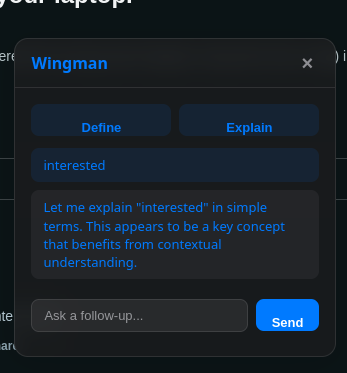
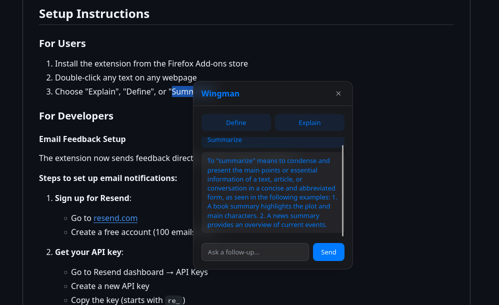
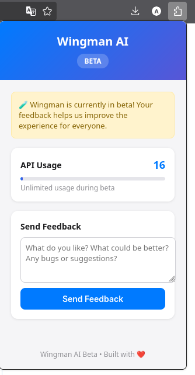

<div align="center">
  <a href="https://github.com/shornalore/wingman">
    
  </a>
  
  # Wingman Extension
  
  Turn any webpage into an interactive knowledge surface. Select text, get instant explanations, definitions, and summaries.
</div>

## Setup Instructions

### For Users
1. Install the extension from the Firefox Add-ons store
2. Double-click any text on any webpage
3. Choose "Explain", "Define", or "Summarize"

### For Developers

#### Email Feedback Setup
The extension now sends feedback directly to your email via Resend.

**Steps to set up email notifications:**

1. **Sign up for Resend**:
   - Go to [resend.com](https://resend.com)
   - Create a free account (100 emails/day)

2. **Get your API key**:
   - Go to Resend dashboard → API Keys
   - Create a new API key
   - Copy the key (starts with `re_`)

3. **Add environment variables to Vercel**:
   - Go to your Vercel project settings
   - Add these environment variables:
     - `RESEND_API_KEY=your_resend_api_key_here`
     - `RECIPIENT_EMAIL=your-email@domain.com`

4. **Deploy**:
   - Push changes to trigger automatic deployment
   - Feedback will now be sent to your email

#### Local Development
```bash
# Install dependencies
npm install

# Run locally
npm run dev
```

## API Endpoints
- `POST /api/ask` - Get AI explanations
- `POST /api/feedback` - Submit feedback (now sends email)

## Features
- Instant text explanations
- Definitions and summaries
- Feedback system with email notifications
- Cross-browser compatibility
- Clean, minimal UI

## Screenshots

<div align="center">
  
  <p><strong>Extension Interface</strong></p>
  
  
  <br>
  
  <p><strong>Text Selection in Action</strong></p>
  
  
  <br>
  
  <p><strong>Feature Overview</strong></p>
  
  
</div>

## Tech Stack
- Frontend: Vanilla JavaScript, CSS
- Backend: Node.js, Vercel Functions
- Email: Resend API
- AI: Groq API (Llama 3.1)
